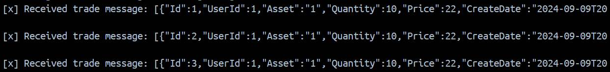

# TraderDirect Demo Project

This is a sample .NET 8 project that demonstrates execution of the user trades. <br>

This repo contains API project built with DDD pattern and a console application servers a message consumer.  <br>

Solution is completely containerized and can be build with provided commands below.

## Steps

Go to root folder
```
docker compose build
docker compose up -d
```

After running the commands, you will see three images running in the traderdirect containers. One of them is the console app, which can be run manually to consume messages from the queue. It is important to update the MSSQL database with the latest migrations to ensure that the app runs as expected.

Go to root folder
```
dotnet ef database update --context TraderDirectDbContext --project TraderDirect.App
```

Use swagger for API definition at:
http://localhost:8080/swagger/index.html

After applying the migrations, the application is ready to execute trades. First, let's create a new user using the User endpoints. 

```
curl -X 'POST' \
  'http://localhost:8080/api/User' \
  -H 'accept: */*' \
  -H 'Content-Type: application/json' \
  -d '{
  "email": "test@gmail.com"
}'
```

Next, execute trades by providing the trade data along with the userId created in the previous step. 

- Use positive quantity for buys and negative for sells. 
- Asset is the unique identifier for the asset. For simplicity, you can use any value you prefer.


```
curl -X 'POST' \
  'http://localhost:8080/api/Trades' \
  -H 'accept: */*' \
  -H 'Content-Type: application/json' \
  -d '{
  "trades": [
    {
      "asset": "2",
      "quantity": 10,
      "price": 20
    }
  ],
  "userId": 2
}'
```
After the trades are executed, an informational message will be published. To view these messages, you can run the console app either locally or in Docker and check the console output to see the executed trades.




Additionally, now we can get these executed trades for all and per user by using GET endpoints.

